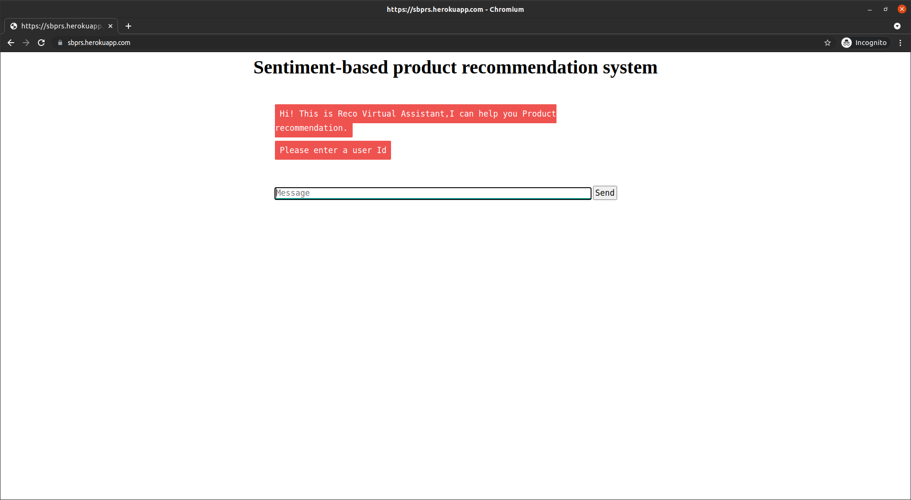
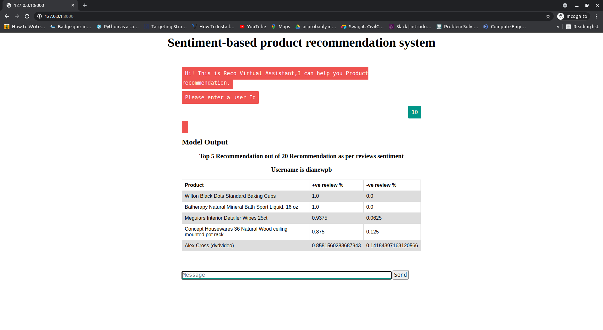

# Sentiment based product recommendation system

### Due to memory issue herokuapp is bit slow try to run in local by using ``` python server.py``` or ``` gunicorn -b 0.0.0.0:8000 server:app ```

## URLS:-

Repo- https://github.com/swagat-panda/sentiment-based-product-recommendation-system

Deployed APP- https://sbprs.herokuapp.com/


## Glance




